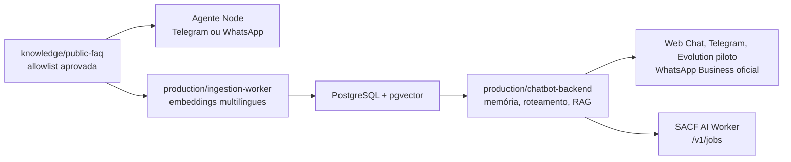

# Arquitetura unificada

## Decisão

O repositório mantém o MVP em Node.js na raiz para demonstrações rápidas no
Telegram e abriga o núcleo de produção em `production/`. O segundo é a base
para a evolução ao WhatsApp Business, não uma segunda base de conhecimento.

## Fonte de conhecimento

`knowledge/public-faq/` é a única fonte permitida para os dois componentes.
Ela contém exclusivamente FAQs aprovadas para clientes e sem seções internas.
O Vault bruto não pertence a este repositório nem deve ser indexado.

## Controles obrigatórios

- O núcleo de produção recupera apenas chunks `public` e `public_suggested`.
- O prompt recebe somente chunks públicos, como defesa adicional.
- Credenciais ficam em `.env` ignorado; jamais em documentação ou Git.
- Telegram permanece restrito a chats autorizados no MVP.
- Perguntas sem evidência suficiente devem receber fallback seguro ou handoff,
  nunca uma resposta inventada.

## Próximos marcos

1. Subir pgvector localmente, configurar embeddings e ingerir a allowlist.
2. Rodar a suíte Python e ampliar os testes em português com o glossário do MVP.
3. Migrar a idempotência por mensagem do piloto para armazenamento durável.
4. Validar o adaptador Evolution/n8n e trocar a instância piloto pela
   `WHATSAPP-BUSINESS` oficial.
5. Entregar handoff real e fila operacional no painel próprio.

## Canal web

O repositório `web-chatbot` fornece a interface pública e usa o endpoint
`/v1/messages` com `channel=web`. O token permanece na camada de servidor da
aplicação web; o navegador nunca acessa diretamente o chatbot, o banco ou o
worker de IA.
