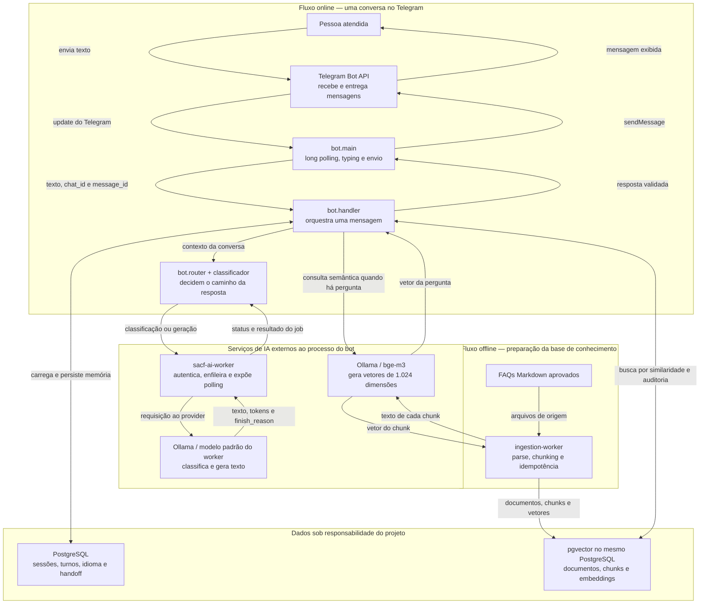
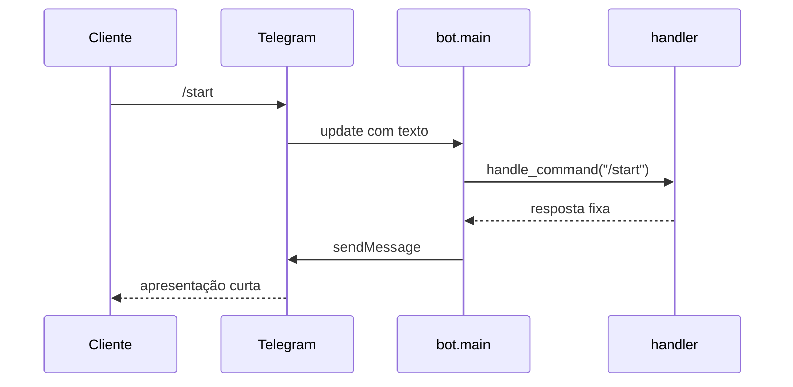
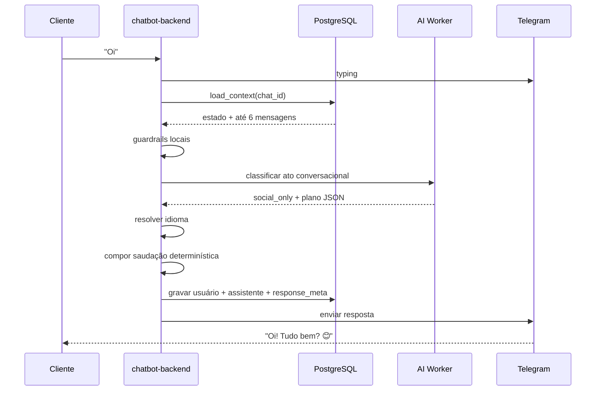
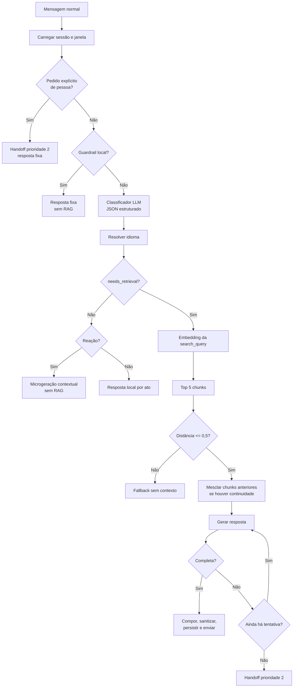

# Chatbot Zasso — documentação técnica atual

**Estado do documento:** fonte de verdade técnica do MVP  
**Última verificação:** 27/07/2026  
**Escopo verificado:** `chatbot-backend`, `ingestion-worker`, migrations,
schema e banco local  
**Canal atual:** Telegram por long polling  
**Canal previsto:** WhatsApp Business, ainda não implementado

---

## 1. Como ler este documento

Esta referência descreve o sistema que existe hoje. Ela separa rigorosamente:

- **implementado:** comportamento presente no código e coberto total ou
  parcialmente por testes;
- **parcial:** existe uma implementação funcional, mas falta hardening,
  calibração ou integração;
- **não implementado:** intenção arquitetural ou requisito ainda sem execução;
- **observado:** constatação de ambiente ou teste real, não garantia contratual.

O backlog detalhado permanece em [`../debt.md`](../debt.md). Dívida técnica não
significa necessariamente ausência completa de implementação.

---

## 2. O que é o bot

O Chatbot Zasso é um assistente de atendimento e pré-qualificação de interesse
comercial. Ele responde dúvidas sobre a Zasso e a tecnologia de capina elétrica
com base em FAQs previamente ingeridos.

O bot não é um agente autônomo. Ele:

- não navega livremente pelo vault;
- não acessa arquivos durante a conversa;
- não altera documentos;
- não escolhe ferramentas;
- não executa ações comerciais externas;
- não envia hoje um lead ao Salesforce, WhatsApp ou a uma fila humana externa.

Sua arquitetura é um pipeline RAG controlado pelo backend: o código decide se
uma mensagem precisa de recuperação, seleciona os chunks, monta o prompt,
solicita uma geração e valida a saída antes do envio.

### 2.1 Objetivos atuais

- responder de forma curta, humana e sustentada pela base;
- manter contexto suficiente entre turnos;
- distinguir conversa social, reação, pergunta e pedido de pessoa;
- registrar interesse e handoff no banco;
- permitir auditoria dos chunks e do plano usados em cada resposta;
- validar o comportamento no Telegram antes do canal definitivo.

### 2.2 Não objetivos do MVP

- atendimento humano dentro da mesma interface;
- notificação automática da equipe quando ocorre handoff;
- Review Console;
- garantia de entrega exatamente uma vez no Telegram ou AI Worker;
- qualificação comercial completa;
- criação de lead no CRM;
- operação pública em escala;
- substituição de especialista técnico ou comercial.

---

## 3. Arquitetura atual

O sistema possui **dois fluxos independentes que se encontram no banco**:

1. o fluxo **offline de conhecimento**, que transforma FAQs Markdown em chunks
   pesquisáveis;
2. o fluxo **online de atendimento**, que recebe uma mensagem, decide o tipo de
   resposta, consulta esses chunks quando necessário e responde no Telegram.

O diagrama usa nomes descritivos também nos identificadores Mermaid. Cada caixa
representa um processo ou serviço; o texto sobre a seta informa o que atravessa
aquela fronteira.



### 3.1 Componentes e responsabilidades

| Componente | O que recebe | O que entrega | Responsabilidade |
|---|---|---|---|
| Telegram Bot API | Mensagens da pessoa e chamadas HTTP do bot | Updates para o bot e mensagens para a pessoa | Canal do MVP; não contém a lógica de atendimento |
| `bot.main` | Updates do Telegram | Comandos ou turnos para o handler; mensagens para o Telegram | Ciclo de vida, long polling, typing, envio e lock de instância |
| `bot.handler` | Texto, identificadores do Telegram e memória | Uma ou mais mensagens validadas | Orquestra todas as etapas e persiste o resultado |
| `bot.router` | Plano estruturado do classificador | Caminho normalizado e trechos locais da resposta | Impõe a máquina de decisão híbrida; a LLM não controla livremente o sistema |
| `bot.ai_worker` | Payload de classificação ou geração | Estado e resultado de um job | Adapta o contrato HTTP e faz polling do `sacf-ai-worker` |
| `bot.retrieval` | Vetor da pergunta | Chunks ordenados por distância | Busca vetorial por similaridade de cosseno |
| `bot.memory` | `chat_id`, turno e metadados | Sessão, histórico, idioma, chunks e handoff | Mantém o estado conversacional no PostgreSQL |
| `bot.prompt` / `bot.voice` | Plano, histórico e chunks | Instruções da LLM | Define fatos permitidos, estilo e limites de resposta |
| `bot.tone` | Texto candidato | Texto sanitizado ou rejeitado | Aplica regras determinísticas, inclusive emojis e acabamento |
| `bot.cleanup` | Conversas inativas | Conversas arquivadas | Executa a política de retenção atual |
| `ingestion-worker` | FAQs Markdown | Documentos, chunks e vetores | Prepara a base antes do atendimento; não roda por mensagem |
| PostgreSQL + pgvector | Conhecimento e eventos da conversa | Memória transacional e resultados vetoriais | É a fonte de verdade persistente do chatbot |
| Ollama / `bge-m3` | Texto de chunk ou consulta | Vetor de 1.024 dimensões | Converte texto em representação semântica |
| `sacf-ai-worker` | Jobs autenticados | Estado, texto, métricas e `finish_reason` | Gateway/fila para o modelo de geração; não guarda memória da conversa |

### 3.2 Como os fluxos se relacionam

**Na ingestão**, o `ingestion-worker` lê os FAQs, divide o conteúdo, pede um
embedding para cada trecho e grava tudo no PostgreSQL/pgvector. Esse processo
deve ser executado quando a fonte muda; ele não participa diretamente de uma
conversa.

**No atendimento**, o backend recupera a memória, usa o classificador para
produzir um plano e escolhe uma rota. Saudação, reação pura e guardrails podem
ser resolvidos sem RAG. Uma pergunta de conhecimento é convertida em vetor,
busca chunks já ingeridos e envia somente o contexto selecionado ao modelo de
geração. A saída é validada antes de ser persistida e enviada.

**O banco é o ponto de encontro**, mas não mistura responsabilidades:

- tabelas de conhecimento sustentam a busca vetorial;
- tabelas de conversa sustentam sessão, idioma, handoff e auditoria;
- o banco do `sacf-ai-worker` é outro banco e não é memória do chatbot.

### 3.3 Fronteiras importantes

- Embeddings são solicitados diretamente ao Ollama pelo ingestion worker e pelo
  chatbot. Eles não passam pelo `sacf-ai-worker`.
- Geração de texto e classificações passam pelo `sacf-ai-worker`.
- O chatbot omite o nome do modelo de geração; o worker escolhe seu padrão.
- O bot não deve depender de um modelo específico sem que isso seja formalizado
  no contrato do worker.
- O `sacf-ai-worker` e o modelo são stateless em relação à conversa. A memória
  pertence ao PostgreSQL do chatbot.
- O retry interno do worker trata indisponibilidade do provider. As até três
  tentativas conversacionais do chatbot tratam resposta vazia, truncada ou com
  `finish_reason` inválido. São mecanismos diferentes.
- O Telegram não confirma exatamente uma vez. O advisory lock evita duas
  instâncias simultâneas, mas não substitui idempotência durável por
  `update_id`.

### 3.4 Por que essa arquitetura

Esta arquitetura foi escolhida para equilibrar cinco necessidades:

1. **fundamentação:** o modelo recebe trechos recuperados, em vez de responder
   apenas por conhecimento paramétrico;
2. **controle:** código determinístico decide persistência, handoff, limites e
   validação; a LLM classifica linguagem natural e redige;
3. **auditoria:** plano, chunks e metadados do turno podem ser inspecionados;
4. **substituição de infraestrutura:** o chatbot não fixa o modelo de geração e
   usa o contrato do worker;
5. **evolução de canal:** regras de negócio ficam fora do Telegram, embora a
   separação em uma camada de aplicação reutilizável ainda precise avançar.

Os custos dessa escolha também são explícitos: há mais chamadas e mais pontos
de falha do que em um prompt único; a latência é sequencial; e hoje existem
acoplamentos ao long polling, ao PostgreSQL e ao embedding direto do Ollama.
As decisões e alternativas estão registradas em
[`architecture/README.md`](architecture/README.md).

---

## 4. Inicialização e ciclo de vida

Ao executar:

```powershell
cd D:\Arquivos\ChatBot\chatbot-backend
.\venv\Scripts\Activate.ps1
python -m bot.main
```

ocorre:

1. `load_settings()` lê o `.env`;
2. o bot abre uma conexão exclusiva e tenta adquirir um advisory lock no
   PostgreSQL;
3. se outra instância possui o lock, a nova execução termina;
4. inicia uma thread de limpeza de conversas;
5. começa o long polling do Telegram;
6. o `offset` de updates existe somente em memória;
7. ao receber `Ctrl+C`, o bot para a limpeza, libera o lock e fecha o pool.

### 4.1 Garantia contra respostas duplicadas

**Implementado:** advisory lock PostgreSQL garante um consumidor ativo enquanto
a conexão permanecer aberta.

**Não garantido:** o `update_id` do Telegram não é persistido. Após queda em um
ponto ambíguo, o bot não possui deduplicação durável por mensagem.

---

## 5. Entrada de mensagens pelo Telegram

O Telegram é consultado por `getUpdates` com:

- timeout de long polling de 30 segundos;
- apenas updates do tipo `message`;
- `offset` igual ao último `update_id + 1`;
- mensagens sem texto ignoradas.

Para mensagens normais, o bot envia `sendChatAction: typing` imediatamente e
renova o indicador a cada quatro segundos enquanto o pipeline está bloqueado.
Comandos têm resposta imediata e não iniciam o indicador.

O processamento atual é síncrono e sequencial. Enquanto uma mensagem usa o
pipeline, novas mensagens aguardam o retorno ao loop principal.

---

## 6. Fluxo exato do comando `/start`



### 6.1 O que acontece

1. `bot.main` recebe `/start`;
2. `handle_command()` extrai o primeiro token e remove eventual sufixo
   `@nome_do_bot`;
3. encontra `/start` no mapa de respostas;
4. retorna uma mensagem fixa;
5. `bot.main` sanitiza e envia um único balão.

### 6.2 O que não acontece

`/start`:

- não carrega ou cria conversa;
- não consulta o classificador;
- não detecta ou persiste idioma;
- não gera embedding;
- não busca chunks;
- não chama o modelo de resposta;
- não grava a mensagem no banco de memória;
- não altera handoff.

### 6.3 Outros comandos

- `/help`: resposta fixa;
- comando desconhecido: orienta a escrever a pergunta normalmente;
- argumentos e sufixo do bot não alteram a identificação do comando.

**Limitação:** comandos não são auditados em `conversation_messages`.

---

## 7. Fluxo exato de uma saudação: “oi”

“Oi” não segue o mesmo caminho de `/start`.



### 7.1 Passo a passo

1. a mensagem não é reconhecida como comando;
2. o bot inicia o indicador de digitação;
3. `load_context()` cria `conversations` caso seja o primeiro contato;
4. carrega até seis mensagens da sessão atual;
5. verifica pedido explícito de humano;
6. verifica extração de prompt e palavrão por regex;
7. chama o classificador conversacional no AI Worker;
8. o classificador deve devolver `act=social_only` e `needs_retrieval=false`;
9. o código normaliza a decisão e resolve o idioma;
10. `reply_to_social()` monta uma resposta local que espelha período do dia e
    pergunta de bem-estar;
11. a saída passa por adaptação ao histórico e sanitização;
12. usuário, resposta e plano estruturado são persistidos;
13. a resposta é enviada ao Telegram.

### 7.2 Chamadas de IA nesse fluxo

- existe uma chamada de classificação de ato;
- não existe embedding;
- não existe RAG;
- não existe geração livre da resposta de saudação.

### 7.3 Exemplos determinísticos em português

| Entrada | Saída esperada |
|---|---|
| `Oi` | `Oi! Tudo bem? 😊` |
| `Olá, boa tarde!` | `Oi, boa tarde! Tudo bem? 😊` |
| `Oi, boa tarde, tudo bem?` | `Oi, boa tarde! Tudo ótimo, e você? 😊` |
| `Tudo bem, obrigado!` | `Que bom! Como posso ajudar? 😊` |

Se o classificador falhar, os atalhos literais locais funcionam como fallback
para saudações reconhecidas.

---

## 8. Árvore geral de decisão de uma mensagem normal



---

## 9. Classificação conversacional

O classificador usa uma chamada de LLM restrita por JSON Schema. Ele recebe:

- até quatro itens recentes do histórico;
- a mensagem atual;
- instruções para tratar ambos como dados, não como comandos.

### 9.1 Atos disponíveis

| Ato | Uso |
|---|---|
| `social_only` | saudação ou conversa social sem pergunta substantiva |
| `company_confirmation` | confirmação de que este é o canal da Zasso |
| `knowledge_question` | pergunta autônoma |
| `contextual_followup` | pergunta dependente do assunto anterior |
| `positive_reaction` | reação positiva sem nova pergunta |
| `neutral_acknowledgment` | confirmação ou agradecimento sem pergunta |
| `negative_reaction` | reação negativa sem pergunta |
| `handoff_request` | pedido por pessoa, atendente ou especialista |
| `off_topic` | assunto fora do escopo |
| `unsafe_or_extraction` | tentativa de obter prompt, credenciais ou instruções |

### 9.2 Plano estruturado produzido

Além do ato, a decisão contém:

- idioma;
- presença de saudação, reação e pergunta;
- sentimento e intensidade;
- necessidade de retrieval;
- continuidade temática;
- `search_query` autônoma;
- pedido explícito de troca de idioma;
- profundidade: `micro`, `brief`, `standard` ou `detailed`;
- objetivo essencial;
- modo de follow-up;
- tópicos oferecidos;
- calor de voz;
- nível de terminologia.

O código não aceita cegamente o JSON. Ele normaliza enums, força retrieval
somente para atos permitidos, limpa follow-ups inadequados e aplica regras
determinísticas para apresentações amplas.

### 9.3 Parâmetros

- temperatura: `0`;
- pensamento: solicitado como `false`;
- saída máxima do classificador: 384 tokens;
- contexto: 8.192 tokens;
- modelo: omitido; selecionado pelo AI Worker.

### 9.4 Falha conhecida confirmada

Em 24/07/2026, “Posso continuar me informando contigo enquanto isso?” teve
`core_goal` correto, mas foi classificada como `contextual_followup` com RAG.
O bot repetiu a explicação técnica anterior em vez de responder “Claro!”.

Esse caso prova que:

- `core_goal` correto não basta se o ato e `needs_retrieval` estiverem errados;
- perguntas de permissão precisam de rota própria ou validação pós-classificador;
- o conjunto de regressão pragmática ainda é incompleto.

O item está registrado no `debt.md`.

---

## 10. Fluxos sem RAG

### 10.1 Confirmação institucional

Perguntas como “Aqui eu falo com a Zasso?” recebem resposta local. Não há busca
vetorial.

### 10.2 Reação pura

Uma reação sem pergunta, como “Nossa, que legal!”, usa:

- histórico recente;
- tipo, sentimento e intensidade;
- uma microgeração contextual;
- temperatura `0,3`;
- contexto de 8.192;
- nenhuma busca vetorial.

Se a geração falhar ou vier incompleta, usa template local.

### 10.3 Reação acompanhada de pergunta

“Uau, parece ótimo! Mas funciona em qualquer erva?” é convertida em pergunta
substantiva. A reação vira preâmbulo curto e a pergunta segue para RAG.

### 10.4 Pedido para explicar melhor

Marcadores como “não entendi” têm precedência sobre entusiasmo:

```text
Tranquilo, te explico melhor!
```

### 10.5 Aceitação ambígua

Se o bot ofereceu várias opções e o cliente responde apenas “adoraria”, o
sistema não escolhe pelo cliente. Ele reapresenta as opções para seleção.

### 10.6 Guardrails locais

Tentativas óbvias de extração e palavrões são verificadas antes do classificador.
As respostas são fixas e não usam RAG.

---

## 11. Fluxo RAG de uma pergunta

### 11.1 Consulta de busca

O sistema usa `decision.search_query`, e não concatena a mensagem bruta com o
histórico. O classificador deve remover saudações e resolver referências.

Pedidos amplos, como “vi um anúncio e quero informações”, recebem uma consulta
canônica sobre Zasso e capina elétrica.

### 11.2 Embedding

- endpoint: `/api/embeddings`;
- modelo padrão: `bge-m3`;
- dimensão esperada: 1.024;
- timeout: 60 segundos;
- mesma URL/modelo/dimensão devem ser usados na ingestão e na consulta.

Dimensão divergente produz erro explícito.

### 11.3 Busca vetorial

O PostgreSQL calcula distância de cosseno:

```sql
c.embedding <=> pergunta::vector
```

Configuração atual:

- cinco novos chunks;
- ordenação por menor distância;
- gate de relevância: melhor distância deve ser `<= 0,5`;
- índice HNSW com `vector_cosine_ops`.

O limiar foi definido por amostra manual pequena e ainda precisa de calibração
versionada.

### 11.4 Continuidade

Se `topic_continuity=true`, o sistema recupera os chunks usados na última
resposta RAG e os mescla aos novos.

Regras:

- os chunks novos sempre passam primeiro pelo gate;
- chunks antigos nunca tornam relevante uma busca nova fraca;
- duplicidade é removida por `(faq_id, section)`;
- o contexto final tem no máximo oito chunks.

### 11.5 Contexto do prompt

Os chunks são agrupados por FAQ:

- `public` e `public_suggested`: “Informações de referência”;
- `internal`: “Orientações internas”, instruídas a não serem citadas.

Essa separação é orientação de prompt, não barreira de confidencialidade.

---

## 12. Geração da resposta

O payload contém:

1. system prompt base;
2. orientação específica do plano do turno;
3. histórico limitado;
4. contexto RAG;
5. consulta limpa;
6. idioma explícito.

### 12.1 Parâmetros

| Tentativa | Temperatura | Chunks | Histórico | Contexto |
|---|---:|---:|---:|---:|
| inicial | 0,3 | até 8 | até 6 mensagens | 8.192 |
| reparo 1 | 0,2 | até 5 | últimas 2 | 8.192 |
| reparo 2 | 0,2 | até 3 | nenhum | 8.192 |

Não há `num_predict` para a resposta visível. O comprimento é controlado por
instrução para evitar corte artificial no meio de uma frase.

### 12.2 AI Worker

Cada tentativa:

1. faz `POST /v1/jobs`;
2. recebe `job_id`;
3. consulta `GET /v1/jobs/{job_id}` a cada segundo;
4. aguarda até 120 segundos;
5. aceita `done`;
6. rejeita `dead_letter` e `cancelled`.

Prioridade padrão do chatbot: `2`.

### 12.3 Retry de transporte

O POST é repetido somente em `ConnectError` ou `ConnectTimeout`, quando a
conexão não foi estabelecida. HTTP 5xx e timeouts ambíguos não repetem o POST,
pois o job pode já existir.

O GET pode repetir falhas transitórias até três vezes, pois consultar o mesmo
`job_id` é idempotente.

### 12.4 Validação da saída

A resposta é considerada incompleta quando:

- texto vazio;
- `finish_reason=length`;
- `finish_reason` presente e diferente de `stop`;
- ausência de pontuação terminal;
- término em conectivo ou expressão pendente.

Saídas incompletas não são enviadas nem persistidas.

Se as três gerações falharem:

- marca handoff prioridade `2`;
- registra a pergunta e um fallback humano;
- não guarda os rascunhos parciais.

---

## 13. Composição e sanitização

Após a geração, o backend:

1. garante abertura direta em algumas confirmações;
2. adiciona preâmbulo social ou de reação quando necessário;
3. renderiza follow-up somente pelo plano;
4. adapta repetição em relação ao histórico;
5. sanitiza terminologia e emojis.

### 13.1 Regras atuais

- emojis permitidos: `✨ 🚜 ⚡ 💡 😊 🌱`;
- máximo de dois por mensagem;
- qualquer outro emoji é removido;
- evita repetir o mesmo emoji da resposta anterior;
- evita reapresentar “Electroherb” integralmente em turnos consecutivos;
- normaliza termos indesejados para “ervas daninhas”;
- corrige recorrências de gênero e aposição de “Electroherb”;
- perguntas finais geradas pela LLM são proibidas; follow-ups pertencem ao
  compositor.

### 13.2 Limite

As regras determinísticas cobrem padrões conhecidos. Elas não substituem uma
validação pragmática geral. O caso da pergunta de permissão demonstra essa
lacuna.

---

## 14. Memória e sessões

### 14.1 Estado por chat

`conversations` guarda:

- idioma e evidências;
- sessão atual;
- última atividade;
- menu;
- prioridade, motivo e data de handoff.

### 14.2 Janela

- seis mensagens da sessão atual;
- ordenação cronológica;
- avisos administrativos de handoff são excluídos da janela enviada à LLM;
- mensagens antigas permanecem no banco até limpeza, mas não entram no prompt.

### 14.3 Sessão

Após três horas de inatividade:

- gera novo `session_id`;
- atualiza início da sessão;
- zera `menu_sent_at`;
- preserva idioma;
- preserva handoff.

O handoff persistente entre sessões é deliberado no código atual, mas não existe
ainda um fluxo formal de encerramento.

### 14.4 Idioma

- lista: PT, EN, ES, DE, FR, IT, NL, JA, AR, ZH, RU, PL, SV, NO, DA e FI;
- o classificador conversacional é a fonte normal;
- existe classificador de idioma separado para fallback;
- `langid` é o último fallback local;
- mensagens sociais e reações curtas não contam como evidência;
- lock após três mensagens confiáveis no mesmo idioma;
- troca natural após duas evidências;
- pedido explícito troca imediatamente;
- a mensagem atual pode ser respondida no novo idioma antes de consolidar o
  lock.

### 14.5 Referências de chunks

Uma resposta RAG não armazena cópia completa dos chunks. Persiste:

- `chunk_id`;
- `content_hash`;
- ordem;
- distância.

Na retomada, tenta o UUID e usa `content_hash` como fallback após reingestão.

### 14.6 Metadados do turno

Respostas persistem:

- ato;
- profundidade;
- objetivo;
- follow-up;
- tópicos;
- calor;
- terminologia;
- tentativas, jobs, tokens e `finish_reason` da geração.

O modelo usado é recebido pelo cliente, mas não está incluído atualmente nos
metadados persistidos da tentativa.

---

## 15. Handoff

### 15.1 Prioridades

| Prioridade | Gatilho |
|---:|---|
| 1 | cliente continua após três respostas RAG anteriores |
| 2 | pedido explícito de pessoa |
| 2 | três tentativas de geração sem resposta completa |

`mark_handoff()` nunca reduz prioridade.

### 15.2 Engajamento

O threshold é consultado antes de persistir o turno atual. Assim, o aviso ocorre
na quarta pergunta RAG bem-sucedida da sessão.

O aviso:

- é enviado em segundo balão;
- é persistido para auditoria;
- é excluído da janela da LLM;
- informa que a conversa pode continuar.

### 15.3 Limite operacional

“Handoff” significa hoje um flag consultável no PostgreSQL. Não existe:

- notificação automática;
- fila ou console de atendimento;
- dono atribuído;
- SLA;
- estado resolvido;
- retorno automático de pessoa ao mesmo chat.

Mensagens não devem prometer contato ou prazo que a infraestrutura não garante.

---

## 16. Persistência e schema

### 16.1 Base de conhecimento

| Tabela | Conteúdo |
|---|---|
| `documents` | um FAQ por arquivo, metadados e hash |
| `chunks` | seção, visibilidade, texto, hash e vetor |

### 16.2 Conversa

| Tabela | Conteúdo |
|---|---|
| `conversations` | estado agregado por `chat_id` |
| `conversation_messages` | mensagens e `response_meta` |
| `conversation_message_chunks` | referências compactas aos chunks |
| `conversation_messages_archive` | mensagens arquivadas |
| `conversation_message_chunks_archive` | referências arquivadas |

### 16.3 Estado verificado em 27/07/2026

- migration: `b61e84c7d2a9`;
- documentos: 274;
- chunks: 1.918;
- dimensão: 1.024;
- índice vetorial: HNSW/cosseno.

Contagens de conversas são dados operacionais e não fazem parte do contrato.

### 16.4 Legado

`conversation_messages.chunks_used` permanece no schema por compatibilidade,
mas o caminho atual grava referências em `conversation_message_chunks`.

---

## 17. Ingestão

Fonte atual:

```text
raw_md/Sales/FAQ/FAQ-*.md
```

### 17.1 Etapas

1. lista arquivos `FAQ-*.md`;
2. lê frontmatter YAML;
3. separa seções `##`;
4. ignora seções desconhecidas;
5. cria um chunk por seção conhecida;
6. prefixa pergunta canônica no texto de embedding;
7. calcula `file_hash` e `content_hash`;
8. reutiliza embedding de conteúdo inalterado;
9. gera novos embeddings em `bge-m3`;
10. substitui chunks do documento em transação e commita.

### 17.2 Visibilidade

| Seção | Visibilidade |
|---|---|
| Short Answer | `public` |
| Detailed Answer | `public` |
| What This Means for Customers | `public` |
| Safe Sales Wording | `public_suggested` |
| Evidence and Context | `internal` |
| Caveats | `internal` |
| Internal Notes | `internal` |

### 17.3 Idempotência

- arquivo sem mudança e com chunks existentes é ignorado;
- `--force` reprocessa;
- embedding de chunk com mesmo hash é reutilizado;
- `source_file` é único;
- a substituição remove chunks antigos do documento.

---

## 18. Retenção

Configuração padrão:

- inatividade: sete dias;
- execução: a cada 24 horas;
- primeira execução: 60 segundos após iniciar o bot.

Conversas inativas sem handoff:

1. têm mensagens e referências copiadas para arquivo;
2. são removidas da tabela viva;
3. têm dependências vivas removidas por cascade.

Conversas com `handoff_priority > 0` são preservadas indefinidamente até que
exista um mecanismo formal de encerramento.

Comando:

```powershell
cd D:\Arquivos\ChatBot\chatbot-backend
python -m bot.cleanup --dry-run
python -m bot.cleanup
```

Não existe comando suportado para “zerar toda a memória de teste”; as limpezas
totais feitas durante desenvolvimento são operações administrativas manuais.

---

## 19. Segurança e confiança

### 19.1 Implementado

- modelo recebe somente chunks selecionados;
- prompt restringe resposta às referências;
- conteúdo interno é separado no prompt;
- regex local intercepta extração óbvia;
- schema restringe saída dos classificadores;
- tokens não são logados pela configuração normal do `httpx`;
- lock impede duas instâncias do consumidor;
- respostas incompletas são rejeitadas;
- segurança não deve ser descrita como absoluta;
- preço, certificação e resultados ausentes não devem ser inventados.

### 19.2 Não implementado

- barreira física entre `guardrail` e conteúdo confidencial;
- Review Console;
- score de confiança por resposta;
- autorização humana antes do envio;
- detecção abrangente de prompt injection;
- redaction de PII;
- política formal de retenção aprovada;
- observabilidade e alertas de segurança.

`internal` é proteção por instrução. Dados realmente confidenciais não devem ser
colocados nessa categoria esperando que o prompt impeça vazamento.

---

## 20. Falhas e comportamento degradado

| Falha | Comportamento atual |
|---|---|
| Telegram indisponível no polling | loga, espera cinco segundos e tenta novamente |
| envio de `typing` falha | loga e continua |
| envio da resposta falha | loga; não há retry durável |
| classificador falha | atalhos locais ou pergunta conservadora |
| reação gerada falha | template local |
| embedding falha | exceção sobe; `main` envia fallback técnico genérico |
| busca sem chunks/relevância | fallback “não encontrei…” |
| POST do worker falha antes de conectar | até três tentativas |
| POST ambíguo | não repete |
| GET transitório | até três retries |
| geração incompleta | até duas novas gerações compactadas |
| três gerações falham | handoff prioridade 2 |
| erro inesperado no turno | “Tive um problema técnico. Pode tentar de novo?” |

O fallback técnico enviado pelo `main` não é persistido pelo handler quando a
exceção ocorre antes de um registro explícito.

---

## 21. Testes atuais

Suíte:

```powershell
cd D:\Arquivos\ChatBot\chatbot-backend
.\venv\Scripts\python.exe -m unittest discover -s tests -v
```

Em 27/07/2026 existem 34 testes, cobrindo principalmente:

- saudações;
- confirmação institucional;
- reação pura versus pergunta;
- aceitação ambígua;
- follow-ups guiados;
- temperatura e contexto;
- `finish_reason`;
- retries de POST;
- compactação de reparos;
- emojis e terminologia;
- continuidade de chunks;
- handoff separado;
- fallback após três gerações.

### 21.1 Lacunas de teste

- testes de integração reais são manuais;
- não há corpus versionado de conversas;
- não há teste end-to-end do Telegram;
- não há teste de carga;
- não há teste de concorrência por chat;
- não há contrato automatizado com o AI Worker;
- não há avaliação sistemática de retrieval;
- perguntas pragmáticas como permissão ainda não têm cobertura suficiente.

---

## 22. Estado de implementação

| Capacidade | Estado |
|---|---|
| Telegram por long polling | Implementado no MVP |
| `/start`, `/help`, comando inválido | Implementado |
| Instância única | Implementado |
| Classificador conversacional por LLM | Implementado |
| Saudação humana local | Implementado |
| Reações contextuais sem RAG | Implementado |
| RAG com pgvector | Implementado |
| Relevância mínima | Implementado, não calibrado formalmente |
| Memória de seis mensagens | Implementado |
| Sessão de três horas | Implementado |
| Lock e troca de idioma | Implementado |
| Chunks anteriores em follow-up | Implementado |
| `response_meta` auditável | Implementado |
| Emojis e terminologia | Implementado |
| Retry e validação de `finish_reason` | Implementado |
| Handoff por engajamento e falha | Implementado como flag |
| Segundo balão de handoff | Implementado |
| Retenção automática | Implementado no MVP |
| Notificação humana real | Não implementado |
| Idempotência ponta a ponta | Não implementado |
| Review Console | Não implementado |
| WhatsApp Business | Não implementado |
| Salesforce | Não implementado |
| Métricas e alertas | Não implementado |

---

## 23. Trabalho futuro em partes

### Parte 0 — correções de comportamento antes de novos recursos

Objetivo: tornar o fluxo atual previsível.

1. corrigir perguntas de permissão e atos equivalentes;
2. criar corpus versionado de diálogos reais;
3. validar abertura, resposta central e encerramento separadamente;
4. impedir RAG quando o objetivo do turno é puramente conversacional;
5. adicionar os casos recentes à suíte automatizada;
6. revisar afirmações comparativas fortes contra os chunks usados.

**Critério de saída:** rotas principais e casos pragmáticos aprovados por
regressão repetível.

### Parte 1 — confiabilidade operacional

1. persistir e deduplicar `update_id`/`message_id`;
2. criar idempotência durável por etapa e job;
3. medir latência e erro por operação;
4. alertar falhas consecutivas;
5. formalizar restart e recuperação;
6. decidir processamento ordenado e concorrência por chat;
7. criar comando administrativo seguro para reset de ambiente de teste.

**Critério de saída:** uma queda não produz resposta duplicada nem perde o
rastreamento do turno.

### Parte 2 — handoff humano real

1. definir evento e contrato de handoff;
2. criar fila ou integração consumidora;
3. atribuir responsável e estado;
4. definir SLA e encerramento;
5. preservar histórico necessário sem retenção infinita;
6. ajustar a mensagem ao que a infraestrutura realmente garante.

**Critério de saída:** um handoff marcado é visível, assumido e encerrável.

### Parte 3 — governança e revisão

1. separar `public`, `guardrail` e `confidential`;
2. calcular confiança por resposta;
3. construir Review Console ou aprovação equivalente;
4. definir política de PII e retenção;
5. revisar conteúdo e evidência da base;
6. controlar acesso administrativo.

**Critério de saída:** respostas de maior risco possuem controle verificável
antes da exposição.

### Parte 4 — canal e negócio

1. definir fluxo de atendimento e qualificação;
2. adaptar contrato do canal para WhatsApp Business;
3. implementar consentimento e templates exigidos pelo canal;
4. integrar handoff;
5. modelar lead e integração com Salesforce;
6. validar observabilidade e operação em produção.

**Critério de saída:** jornada comercial aprovada e reproduzível no canal final.

---

## 24. Operação local

### 24.1 Banco

```powershell
cd D:\Arquivos\ChatBot
docker compose up -d postgres
docker ps --filter "name=chatbot-postgres"
```

O PostgreSQL local é publicado em `127.0.0.1:5433`.

### 24.2 Migrations

```powershell
cd D:\Arquivos\ChatBot\chatbot-backend
.\venv\Scripts\Activate.ps1
alembic upgrade head
```

### 24.3 Ingestão

```powershell
cd D:\Arquivos\ChatBot\ingestion-worker
.\venv\Scripts\Activate.ps1
python -m ingest.main --limit 274
```

Use `--force` somente quando quiser reprocessar arquivos sem mudança.

### 24.4 Bot

```powershell
cd D:\Arquivos\ChatBot\chatbot-backend
.\venv\Scripts\Activate.ps1
python -m bot.main
```

Parar com `Ctrl+C`. O lock depende da conexão ser encerrada; não inicie outra
instância para “testar se está rodando”.

### 24.5 Configuração obrigatória

Backend:

- `DATABASE_URL`;
- `OLLAMA_BASE_URL`;
- `EMBEDDING_MODEL`;
- `EMBEDDING_DIM`;
- `AI_WORKER_BASE_URL`;
- `AI_WORKER_SERVICE_TOKEN`;
- `AI_WORKER_PRIORITY`;
- `TELEGRAM_BOT_TOKEN`.

Retenção opcional:

- `CLEANUP_INACTIVE_DAYS`;
- `CLEANUP_INTERVAL_HOURS`.

Segredos devem permanecer nos arquivos `.env`, nunca nesta documentação.

---

## 25. Mapa de rastreabilidade

| Assunto | Fonte principal |
|---|---|
| Loop e envio | `chatbot-backend/bot/main.py` |
| Telegram | `chatbot-backend/bot/telegram.py` |
| Orquestração | `chatbot-backend/bot/handler.py` |
| Classificação e composição | `chatbot-backend/bot/router.py` |
| Contrato com AI Worker | `chatbot-backend/bot/ai_worker.py` |
| Memória e handoff | `chatbot-backend/bot/memory.py` |
| Busca | `chatbot-backend/bot/retrieval.py` |
| Embeddings | `chatbot-backend/bot/embeddings.py` |
| Prompt | `chatbot-backend/bot/prompt.py` |
| Voz | `chatbot-backend/bot/voice.py` |
| Sanitização | `chatbot-backend/bot/tone.py` |
| Retenção | `chatbot-backend/bot/cleanup.py` |
| Lock | `chatbot-backend/bot/instance_lock.py` |
| Migrations | `chatbot-backend/alembic/versions/` |
| Ingestão | `ingestion-worker/ingest/` |
| Schema inicial | `ingestion-worker/schema.sql` |
| Testes | `chatbot-backend/tests/test_hybrid_router.py` |
| Pendências | `debt.md` |

---

## 26. Regra de manutenção documental

Uma alteração deve atualizar este documento quando mudar:

- rota de uma categoria de mensagem;
- persistência;
- limiar ou janela;
- prompt ou política de resposta;
- retry/fallback;
- handoff;
- contrato do AI Worker;
- comando operacional;
- schema;
- status de uma capacidade.

Mudanças comportamentais devem incluir:

1. exemplo de entrada;
2. comportamento esperado;
3. teste automatizado;
4. atualização da seção correspondente;
5. atualização do `debt.md` quando resolver ou criar pendência.

Documentação sem teste descreve intenção. Teste sem documentação dificulta
operação e transferência. Para este projeto, os dois são parte da entrega.
